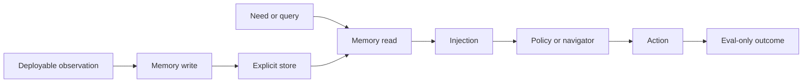
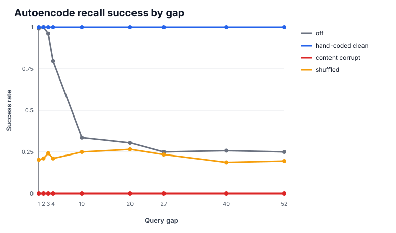
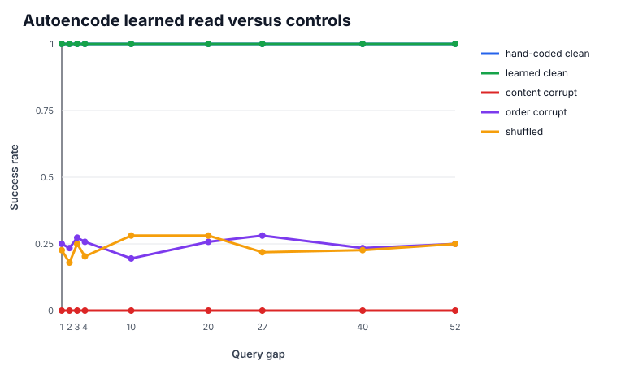
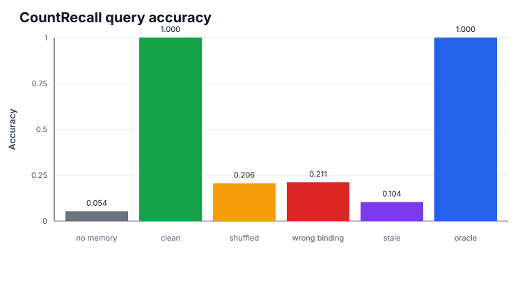
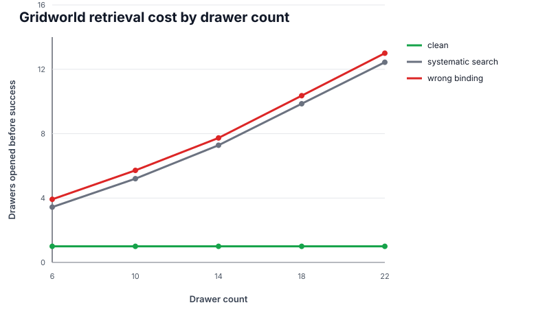

# Explicit Decoupled Memory for Sequential Agents

Evidence consolidation v0.

This artifact consolidates the controlled evidence currently reproducible in
this repository for explicit, decoupled memory in sequential agents.

## Sized Claim

The current evidence supports a bounded mechanism claim:

```text
An explicit decoupled memory store can be written, learned, retrieved, and
injected into a policy decision to improve controlled-task recall accuracy and
retrieval efficiency on tasks where correct stored content is required.
```

This is shown across four controlled rungs:

- explicit memory recovers information beyond the measured saturation of a
  task-trained recurrent baseline;
- a learned associative reader recovers the hand-coded memory ceiling;
- recalled content can drive an action-level decision on a recall task;
- recalled location content can drive a goal-conditioned navigator, making
  retrieval cheaper as the number of candidate locations grows.

The claim is deliberately not broader than that.

## Non-Claims

This artifact does not claim:

- learned write selection or full episodic memory management;
- portability to external frozen backbones;
- cross-episode memory;
- world-like perception or high-dimensional visual grounding;
- reinforcement-learning reward improvement;
- Crafter competence or general embodied-agent competence.

The write-selection problem is still open. The portability problem is still
open. Closed-loop reward performance with a fair RL baseline is still open.

## Methodological Spine

The rungs use the same discipline:

- **Fair baseline:** compare against a competent alternative, such as a
  task-trained GRU or systematic search, not a blind floor.
- **Corruption controls:** shuffled, wrong-binding, stale, content-corrupt, or
  order-corrupt arms test whether the effect depends on correct stored content.
- **Crossover or scaling:** the effect must appear where the baseline fails, or
  grow with the controlled variable.
- **Evaluability gates:** contamination checks and task reachability must pass
  before interpreting effect size.
- **Anti-selection:** tuning and final reporting must stay separated. Apparent
  wins from a tuned scalar on the same episodes are not evidence.

## Mechanism Overview



The key distinction is that eval-only fields can score the outcome, but actor
and query inputs must come from deployable observations or agent-owned memory.

## Evidence Rung 1: Recall Past Recurrent Saturation

**Question:** Can explicit memory recall information after a fair recurrent
baseline falls off?

**Task:** POPGym Autoencode Easy.

**Source artifacts:**

- `runs/popgym_autoencode_recurrent/popgym_autoencode_summary.json`
- `runs/popgym_autoencode_recurrent/memory_curve.json`

**Result:** The recurrent no-memory curve is near ceiling at short gaps and
falls toward chance at long gaps. Hand-coded ordered memory remains at 1.0
success across all tested gaps. Corrupt controls fall to low success.



Representative success rates:

| Gap | No memory | Hand-coded clean | Content corrupt | Shuffled |
| ---: | ---: | ---: | ---: | ---: |
| 1 | 0.992188 | 1.0 | 0.0 | 0.203125 |
| 4 | 0.796875 | 1.0 | 0.0 | 0.210938 |
| 10 | 0.335938 | 1.0 | 0.0 | 0.25 |
| 27 | 0.25 | 1.0 | 0.0 | 0.234375 |
| 52 | 0.25 | 1.0 | 0.0 | 0.195312 |

Each row uses 128 sequences per arm and gap.

**Supports:** Explicit memory fills a measured recurrence gap.

**Does not support:** Learned write selection or task performance beyond recall
itself.

## Evidence Rung 2: Learned Associative Read

**Question:** Can a learned memory reader recover the hand-coded ceiling?

**Task:** POPGym Autoencode Easy, learned explicit-position associative memory.

**Source artifacts:**

- `runs/popgym_autoencode_recurrent/learned_memory_curve.json`
- `runs/popgym_autoencode_recurrent/learned_memory_checkpoint/manifest.json`

**Result:** Learned clean memory matches hand-coded clean memory at 1.0 success
across gaps `[1, 2, 3, 4, 10, 20, 27, 40, 52]`. Content corruption falls to
0.0. Order corruption and shuffled controls remain near chance.



Aggregate success:

| Arm | Success |
| --- | ---: |
| Hand-coded clean | 1.0 |
| Learned clean | 1.0 |
| No memory | 0.572049 |
| Content corrupt | 0.0 |
| Order corrupt | 0.248264 |
| Shuffled | 0.235243 |

Each aggregate arm has 1152 evaluated rows.

**Supports:** The read can be learned; the model learned content and order
bindings well enough to recover the hand-coded ceiling.

**Does not support:** Learned memory management. The write rule still stores the
needed sequence rather than learning which events deserve storage.

## Evidence Rung 3: Action-Level Injection

**Question:** Can recalled content be injected into a decision when the correct
action is the recalled value?

**Task:** POPGym CountRecall Hard.

**Source artifacts:**

- `runs/popgym_count_recall_injection/popgym_count_recall_summary.json`
- `runs/popgym_count_recall_injection/metrics_by_arm.json`

**Result:** Clean memory and eval-only oracle reach 1.0 query accuracy.
No-memory is near floor. Corruption controls degrade strongly.



| Arm | Query accuracy | Mean reward | Invalid action rate |
| --- | ---: | ---: | ---: |
| No memory | 0.053744 +/- 0.003914 | -0.892512 | 0.0 |
| Clean memory | 1.0 +/- 0.0 | 1.0 | 0.0 |
| Shuffled | 0.206295 +/- 0.010051 | -0.587409 | 0.0 |
| Wrong binding | 0.211277 +/- 0.010061 | -0.577446 | 0.0 |
| Stale | 0.103865 +/- 0.006417 | -0.792271 | 0.0 |
| Eval-only oracle | 1.0 +/- 0.0 | 1.0 | 0.0 |

Intervals are 95% normal-approximation intervals over 64 episodes per arm.

**Named deviation:** POPGym CountRecall has an integer-division/action-space
off-by-one in the installed source. In `popgym/envs/count_recall.py`,
line 62 sets `self.max_card_count = int(self.value_deck.num_cards /
self.num_distinct_cards)`, line 75 declares
`gym.spaces.Discrete(self.max_card_count)`, line 98 sets the target to
`prev_count = self.counts[self.prev_query]`, and line 103 rewards
`action == prev_count`. For `CountRecallHard`, the declared action space is
`Discrete(16)` while seed `12000`, tick `191` reaches target count `16`;
`action_space.contains(16)` is false, but stepping with action `16` receives a
positive reward. The probe corrects the local declared action space with
`count_recall_inclusive_max_count_action_space_v0`; all arms use the same
corrected space. This result should be reported as corrected CountRecall, not
stock CountRecall.

**Supports:** Recalled content can cross from memory into a policy decision.

**Does not support:** Goal-conditioned injection. Here the action is the
recalled count.

## Evidence Rung 4: Goal-Channel Injection

**Question:** Can recalled content become a navigation goal for a policy whose
actions are computed over multiple steps?

**Task:** Controlled gridworld kitchen abstraction.

**Source artifacts:**

- `runs/gridworld_kitchen_injection/gridworld_injection_summary.json`
- `runs/gridworld_kitchen_injection/metrics_by_arm.json`

**Protocol:** reveal object location, write it to agent-owned memory, occlude,
query the needed object, inject the recalled drawer as a goal into a frozen
goal-conditioned navigator. If a memory-directed drawer is wrong, the agent
then falls back to systematic sweep.

**Primary metric:** drawers opened before success. This isolates search cost
from grid traversal geometry.



Aggregate result over drawer counts `[6, 10, 14, 18, 22]`:

| Arm | Success | Drawers opened | Steps | Wrong drawer rate |
| --- | ---: | ---: | ---: | ---: |
| Systematic search | 1.0 | 7.64375 | 39.05625 | 0.909375 |
| Clean memory | 1.0 | 1.0 | 5.54375 | 0.0 |
| Shuffled | 1.0 | 8.146875 | 42.146875 | 1.0 |
| Wrong binding | 1.0 | 8.146875 | 42.2875 | 1.0 |
| Stale | 1.0 | 8.11875 | 42.015625 | 1.0 |
| Eval-only oracle | 1.0 | 1.0 | 5.54375 | 0.0 |

Drawers opened before success, with 95% intervals over 320 episodes per arm:

| Arm | Drawers opened |
| --- | ---: |
| Systematic search | 7.64375 +/- 0.590433 |
| Clean memory | 1.0 +/- 0.0 |
| Wrong binding | 8.146875 +/- 0.567644 |

The clean-memory zero interval is structural: the controlled navigator opens
exactly the injected target drawer when the remembered location is correct.

Drawer-count sweep:

| Drawer count | Clean drawers | Search drawers | Clean-minus-search gap |
| ---: | ---: | ---: | ---: |
| 6 | 1.0 | 3.4375 | 2.4375 |
| 10 | 1.0 | 5.203125 | 4.203125 |
| 14 | 1.0 | 7.28125 | 6.28125 |
| 18 | 1.0 | 9.859375 | 8.859375 |
| 22 | 1.0 | 12.4375 | 11.4375 |

Each drawer-count row uses 64 seeds. Aggregate wrong-binding step cost is
3.23125 steps over no-memory search.

**Supports:** Goal-channel injection works when recall and action are separated
by the policy's path computation. The memory advantage grows with search-space
size. Wrong-binding costs more steps than no memory because the navigator
commits to the wrong recalled goal before falling back to search.

**Does not support:** Learned write selection, cross-episode memory, real
perception, or external-backbone portability.

## Negative and Scoped-Out Diagnostics

Some probes are useful because they prevented overclaiming:

- Crafter long-run work supports memory-evaluability and mechanism diagnostics,
  not Crafter competence.
- Closed-loop reward probes showed that behavior-cloned recurrent baselines can
  have high per-step teacher agreement while failing task completion. A fair RL
  baseline is required before making reward-performance claims.
- Maze-like task scouting found runnable environments, but runnable is not the
  same as memory-necessary.
- A tuned scalar bias can create apparent survival gains on a tiny evaluation
  set. Those numbers should not be treated as memory evidence without held-out
  selection discipline.

These diagnostics explain the narrower ladder above.

## Current Boundary

The current consolidated evidence is strongest for:

```text
controlled within-episode associative recall and injection efficiency
```

It is not yet evidence for:

```text
portable memory across external backbones
learned write selection
cross-episode memory
RL reward improvement
world-like embodied competence
```

## Next Keystone Choice

The next investment depends on the desired claim.

| Desired claim | Required next step |
| --- | --- |
| Injection efficiency | This artifact is sufficient to review as a complete controlled result. |
| External-backbone portability | Scout and reproduce a competent external goal-conditioned backbone, then measure adapter cost and shuffle-gated memory lift. |
| Full episodic memory | Build a distractor-heavy task where storing everything fails and a learned write-selection rule is required. |
| Reward-performance improvement | Build or borrow a fair RL baseline first. |

The most valuable next step for the broader thesis is external-backbone
portability, but only after verifying that a competent, runnable,
goal-conditioned candidate backbone is actually obtainable.

## Reproduction Commands

Generate the figures:

```bash
python3 scripts/build_evidence_consolidation_figures.py
```

Run the artifact-producing probes:

```bash
python3 scripts/train_popgym_autoencode.py \
  --config configs/popgym_autoencode_recurrent.yaml \
  --out runs/popgym_autoencode_recurrent

python3 scripts/probe_popgym_count_recall_injection.py \
  --config configs/popgym_count_recall_injection.yaml \
  --out runs/popgym_count_recall_injection

python3 scripts/probe_gridworld_injection.py \
  --config configs/gridworld_kitchen_injection.yaml \
  --out runs/gridworld_kitchen_injection
```

Run package validation:

```bash
python3 -m compileall -q embryo scripts tests examples
python3 -m unittest discover -s tests
python3 scripts/check_release.py
```
